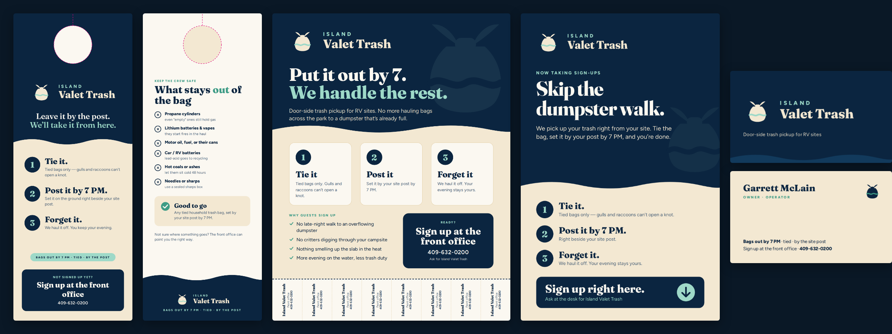

# The McLain System

Fifteen ventures, one sun. A 3D star map of Garrett McLain's ventures orbiting **Zachary**, the reason for all of it. A Gravity Engine decides where each planet sits: the closer it orbits, the more of this week it deserves.

**Live version (full features):** https://claude.ai/artifact/SanF9unpxFR8EjK7qiWPh5



> **This repository is public by choice.** The designs of GloveGate and AquaStep are deliberately left out of every file here. Keep them out until a patent filing decision is made: a public disclosure forfeits patent rights in Europe, China, Japan and Korea. The deployed app stays behind a password so nobody else can spend your API credits.

## What's in it

- **The star map.** WebGL (three.js r128). The sun, fifteen procedurally shaded planets and four idea comets. Drag to orbit, then tap a planet or comet to open its panel: next move, deadline, what was built for it, and why it sits where it does.
- **The Gravity Engine.** Every venture is scored 1–5 on five pulls and one drag. Your weights set how much each counts, and the planets re-orbit live when you change them.
- **Ask the System.** Claude reads every planet, score, deadline and weight before answering. It can re-weight the engine or fly the map to a planet. Tick **Also ask ChatGPT** to get a second opinion side by side.
- **Mission feed.** Live data from your own connected accounts: open actions (Vertiso Memory), Aurora deploys (Vercel), VaultOS (Lovable), the STILL STANDING teaser (Descript) and an RV market pulse (Twelve Data).
- **Undiscovered planets.** Four new business ideas built from assets you already have: Storm-Ready Hosts, Pedestal Safety Audit, Valet Trash Park Kit and Park Energy Audit.
- **Freedom compounding.** When your savings start paying for your time, using the 25× rule of thumb.
- **STILL STANDING.** The opening scene, next to an animated scene of the room, the rising water and the flame.
- **Island Valet Trash print kit.** Door hanger (front/back), flyer with tear-off tabs, business card (front/back) and an 11×17 front-office sign, all in one print-ready PDF.

## Two ways to run it

| | In Claude (live link above) | Standalone (`index.html`) |
|---|---|---|
| 3D map, panels, Gravity Engine | ✓ | ✓ |
| Weights remembered | Saved to the System (every device) | Saved on this device |
| Daily briefing | Updated by Claude | Built-in default |
| Ask the System (Claude) | ✓ | ✓ when deployed with `ANTHROPIC_API_KEY` |
| ChatGPT second opinion | ✓ through your Zapier connector | ✓ when deployed with `OPENAI_API_KEY` |
| Live connector feeds | ✓ (your accounts) | Links to the live version |
| Add to iPhone home screen | – | ✓ (installable web app) |
| Print PDF | Save button | Download link |

To run it standalone, you need an internet connection (three.js and the fonts load from CDNs):

```bash
npm run serve        # then open http://localhost:8000
```

Opening `index.html` directly in a browser also works for everything except the PDF link on some browsers.

## Your iPhone app (private Vercel deployment)

The repo deploys to Vercel as a password-protected web app you can add to your home screen.

- `middleware.js` locks every page and API route behind `SITE_PASSWORD`. With no password set, the site serves nothing.
- `login.html` and `api/login.js` sign a device in with an HttpOnly cookie that lasts 90 days. Changing `SITE_PASSWORD` signs every device out.
- `api/ask.js` sends Ask the System to Claude (Claude Opus 5, with server-side fallbacks on) using `ANTHROPIC_API_KEY`.
- `api/chatgpt.js` gets the ChatGPT second opinion using `OPENAI_API_KEY` (optional; `OPENAI_MODEL` defaults to `gpt-4o`).
- `api/health.js` tells the page which of the two are configured. It never returns key values.

Environment variables (Vercel → Project → Settings → Environment Variables):

| Name | Required | What it's for |
|---|---|---|
| `SITE_PASSWORD` | Yes | The password you type on the login screen |
| `ANTHROPIC_API_KEY` | For Ask | Claude answers |
| `OPENAI_API_KEY` | Optional | ChatGPT second opinion |
| `OPENAI_MODEL` | Optional | Override the ChatGPT model |

To install it on an iPhone, open the site in Safari, sign in, then tap Share → **Add to Home Screen**.

## Editing

`src/system.html` is the single source. It's the exact page published to Claude as an artifact (a fragment without `<html>`/`<head>`, which claude.ai adds).

```bash
npm run build        # rewrites index.html from src/system.html
npm run icons        # re-renders the home-screen icons (needs Playwright)
```

To update the live Claude version, ask Claude to republish `src/system.html` to the artifact URL above, with `kit-sheet.png` and `Island_Valet_Trash_Print_Kit.pdf` as supporting files.

### Where things live in `src/system.html`

| What | Look for |
|---|---|
| Ventures, scores, rationale, next moves | `const VENTURES` |
| Idea comets | `const COMETS` |
| Deadlines on the map | `const DEADLINES` |
| Default weights | `const W_DEFAULT` |
| Default briefing | `const BRIEF_DEFAULT` |
| Park prospects | `const PROSPECTS` |
| Live feeds (connector, tool, input) | `const FEEDS` |
| Planet shaders and scene | `function initCosmos` |

## How the Gravity Engine decides

For each venture, with every score from 1 to 5 and every weight from 0 to 2:

```
raw     = w_speed·speed + w_cash·cash + w_stability·stability + w_deadline·deadline + w_meaning·meaning − w_blockers·blockers
gravity = (raw − min) / (max − min) × 100
          min = Σw_pulls·1 − w_blockers·5      max = Σw_pulls·5 − w_blockers·1
```

The deadline score comes from the real calendar: 7 days or less = 5, 45 = 4, 120 = 3, 240 = 2, later = 1. Default weights: speed 1.3, cash 1.0, **stability 1.5**, deadline 1.0, meaning 0.5, blockers 0.8.

Worked example, Jamaica Ops on Sept 25, 2026: 3.9 + 4 + 6 + 5 + 1.5 − 2.4 = 18.0, which scales to 68 of 100 and puts it in orbit 1.

The 1–5 scores are estimates drawn from Garrett's notes, and they're meant to be argued with.

## Regenerating the print kit

```bash
cd print-kit
npm install
npx playwright install chromium
node kit.cjs      # writes out/*.pdf, out/*.png and out/Island_Valet_Trash_Print_Kit.pdf
node sheet.cjs    # writes out/kit-sheet.png (preview of every piece)
```

Fonts are Fraunces and Figtree (SIL Open Font License), bundled in `print-kit/fonts`. The sign-up number on the pieces is the resort's main line. Use it only after the front office agrees to take sign-ups.

## Sources

- USPTO provisional filing fee: $325 large, $130 small, $65 micro entity (37 CFR 1.16(d)).
- Texas Certificate of Formation for an LLC (Form 205): $300.
- NSF SBIR/STTR Phase I: up to $275K; the Nov 4, 2026 deadline requires an accepted Project Pitch first.
- County records: Nacogdoches and Milam on publicsearch.us; Robertson, Schleicher, Houston, Fannin and Kaufman on TexasFile; wells on the Railroad Commission GIS viewer (not a legal record).
- Park prospects: independent, waterfront, 75+ sites, from a 78-park Gulf Coast list compiled Sept 25, 2026. Confirm details before calling.
